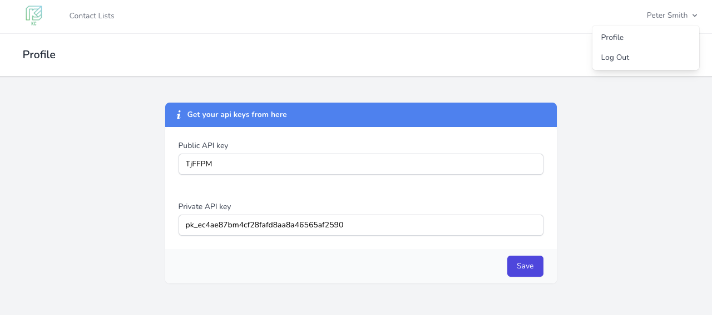
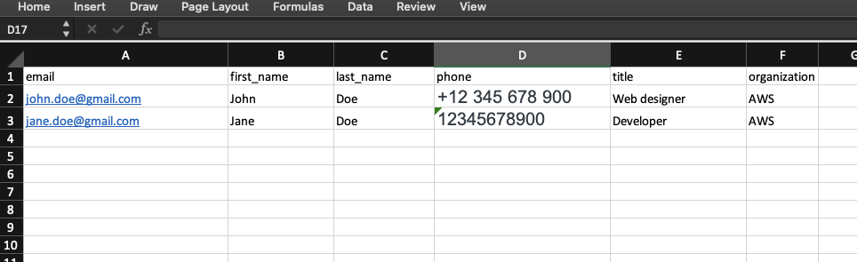
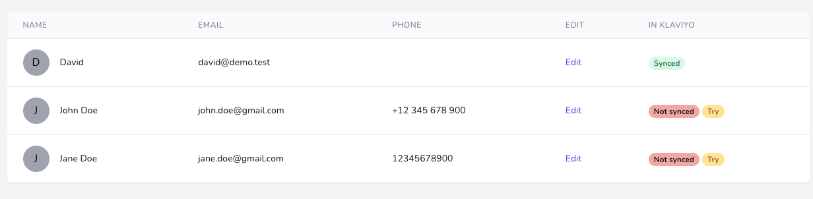

# Klaviyo contacts task 
Klaviyo contacts is a system in which user can register, create and edit contact lists with contacts. Each contact list can hold multiple contacts with its properties such as email, first name, title, organization and phone. Every contact list and contact can be sync within an account in www.klaviyo.com. After the user register there. He will get an public and private API keys. After they put them in their profile, all of the created contact lists or contacts will automatically be send to their klaviyo account. You can also mass import contacts from Excel (xlsx) with heading columns - email, first_name, last_name, title, organization, phone (the phone must be in compatible format - help.klaviyo.com). Those contacts wont be automatically sent in klaviyo. Each contact can be send after that individually.

#Staging environment
You can test everything here.
```
https://klaviyo-contacts.atomdev.dev/
```

## Requirements
```
PHP >= 7.4
composer
node
npm
MySQL or PostgreSQL
Redis
```


## Installation
```
composer install
npm install && npm run dev
cp .env.example .env
php artisan key:generate
```
Configure your DB in the .env and set these variables

```
CACHE_DRIVER=redis
QUEUE_CONNECTION=redis
SESSION_DRIVER=redis
```
Now you can run your migration and start the migration and the queue system.

```
php artisan migrate
php artisan horizon
```

- [ ] With Laravel Horizon you can monitor your queued jobs.
- [ ] Horizon exposes a dashboard at the /horizon

## Screenshots
 In your profile you can set the api keys from after you make a registration https://www.klaviyo.com/account#api-keys-tab


  
Import contacts Excel file example. (The phone must compile with the standards given in [here](https://help.klaviyo.com/hc/en-us/articles/360046055671-Accepted-Phone-Number-Formats-for-SMS-in-Klaviyo#accepted-phone-number-formats1))  



If some row misses its klaviyo_id it means it's not synced in Klaviyo.
You click "try" the system will run a job that will send the information.
When you refresh the page the row should be synced




